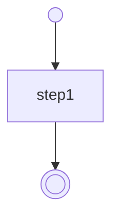

We are excited to announce the release of **Serverless Workflow TypeScript SDK v1.0.1**! This update brings back the much-requested **Mermaid flowchart generation** feature and introduces a brand-new **directed graph generation** capability.

## Background

The Serverless Workflow TypeScript SDK was recently rewritten to fully support the **Serverless Workflow Specification v1.0.0**, marking a significant milestone in its development. However, during this major overhaul, the **Mermaid flowchart generation** feature was temporarily lost.

With the release of v1.0.1, we are pleased to restore this functionality and introduce an additional way to visualize workflows: **directed graph generation**.

## Installation

To get started with the latest version of the SDK, install it via npm:

```sh
npm install @serverlessworkflow/sdk
```

## Mermaid Flowchart Generation

Mermaid flowcharts provide a simple way to visualize workflows in a declarative format. In v1.0.1, the SDK allows users to easily convert workflow definitions into Mermaid diagrams.

### Example: Generating a Mermaid Flowchart

```typescript
import { convertToMermaidCode, MermaidDiagram } from '@serverlessworkflow/sdk';

const workflow = {
  document: {
    dsl: '1.0.0',
    name: 'using-plain-object',
    version: '1.0.0',
    namespace: 'default',
  },
  do: [
    {
      step1: {
        set: {
          variable: 'my first workflow',
        },
      },
    },
  ],
};
const mermaidCode = convertToMermaidCode(workflow); /* or */
// const mermaidCode = new MermaidDiagram(workflow).sourceCode();
// const workflow = new Classes.Workflow({...}); const mermaidCode = workflow.toMermaidCode();
// const mermaidCode = Classes.Workflow.toMermaidCode(workflow);
```

### Output Mermaid Code



## Directed Graph Generation

In addition to Mermaid flowcharts, v1.0.1 introduces **directed graph generation**, which represents workflows as structured graph objects.

### Example: Generating a Directed Graph

```typescript
import { buildGraph } from '@serverlessworkflow/sdk';

const workflow = {
  document: {
    dsl: '1.0.0',
    name: 'using-plain-object',
    version: '1.0.0',
    namespace: 'default',
  },
  do: [
    {
      step1: {
        set: {
          variable: 'my first workflow',
        },
      },
    },
  ],
};
const graph = buildGraph(workflow);
// const workflow = new Classes.Workflow({...}); const graph = workflow.toGraph();
// const graph = Classes.Workflow.toGraph(workflow);
```

### Sample Output

```json
{
  "id": "root",
  "type": "root",
  "parent": null,
  "nodes": [...], // length 3 - root entry node, step1 node, root exit node
  "edges": [...], // length 2 - entry to step1, step1 to exit
  "entryNode": {...}, // root entry node
  "exitNode": {...} // root exit node
}
```

## Try It Now!

The latest version of the Serverless Workflow TypeScript SDK makes it easier than ever to visualize and analyze workflows. We invite you to install the update and try out the new features.

🔗 **Repository:** [Serverless Workflow TypeScript SDK](https://github.com/serverlessworkflow/sdk-typescript)

